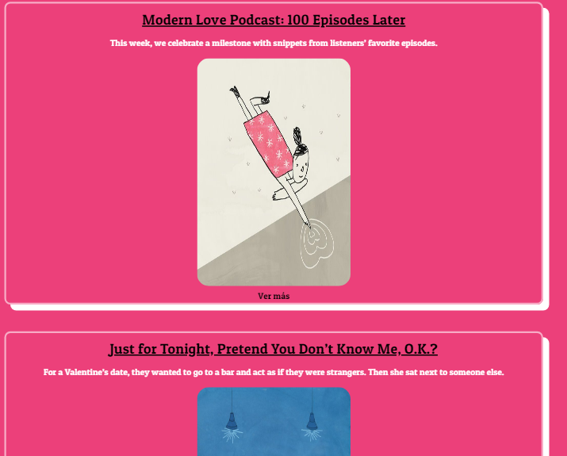

# XHR- proyect- Demo

## Objetivo
El presente trabajo es realizar una petición a la página New York Times y con ella traer los artículos.Todo ello es elaborado con el `api fetch`.

## Herramientas
* Javascript
* HTML
* [New York Times APIs](https://developer.nytimes.com/faq)
* Ajax

# Layaout Inicial

## Resultado
Para hacer la petición de los articulos, se debe hacer lo siguiente:

- En la entrada se escribe un tema en especial que desees leer, en este caso `love` y dar click en `send`.

- Finalmente apareceran los artículos que tengan el tema referido.En ello encontrarás: el título del articulo, el resumen y finalmente un link pra que puedas ver más sobre ese artículo.

